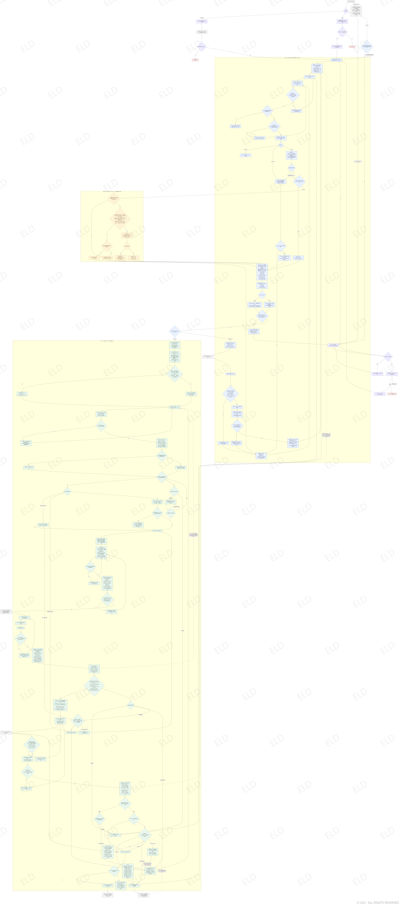

# 理解成本学习导航

**当前版本：v4.0.0**

同一个知识点，不同的人缺少的前置知识并不相同。本 Skill 会先了解你已经会什么，再规划学习顺序，用尽量容易理解的方式分步教学。

## 适合这些情况

- 想从零学习一个知识点；
- 看过教程，但总有些地方接不上；
- 想知道学习目标需要哪些前置知识；
- 想梳理一个领域的整体地图，或继续上次的学习路线。

## 你会得到什么

1. 一条基于现有基础的学习路径；
2. 当前只需要理解的一小步讲解；
3. 必要时提供文字文件、对话或具体图示；
4. 用新的小任务检查是否真正掌握，再决定继续还是补前置。

知识图谱、学习画像、证据记录和内部排序默认只供 Agent 规划教学，不会把复杂的内部数据直接展示给你。只有你主动要求查看或校正时，才会提供可读的说明。

## 使用示例

> 我完全不懂 Live2D，请根据我的基础一步步教我绑定模型。

> 我想学习递归，但不知道自己缺少哪些前置知识。

未经允许不会保存结构化学习记录；如果需要继续既有路线，会先确认原来的数据位置。

开发、校验与 Demo 复现说明见 [维护者指南](references/maintainer-guide.md)。

## 版权与使用限制

Copyright © 2026 ELD. All Rights Reserved。本仓库不是开源项目。经 ELD 授权的接收者仅可为个人、非商业目的下载、安装、运行并在自己的 Agent 中测试；未经书面许可，禁止商业使用、二次发布、转载、转发、镜像、重新打包、借给或提供给第三方、出售、出租、再许可，以及传播修改版或衍生版。详细条款见 [LICENSE](LICENSE)。
